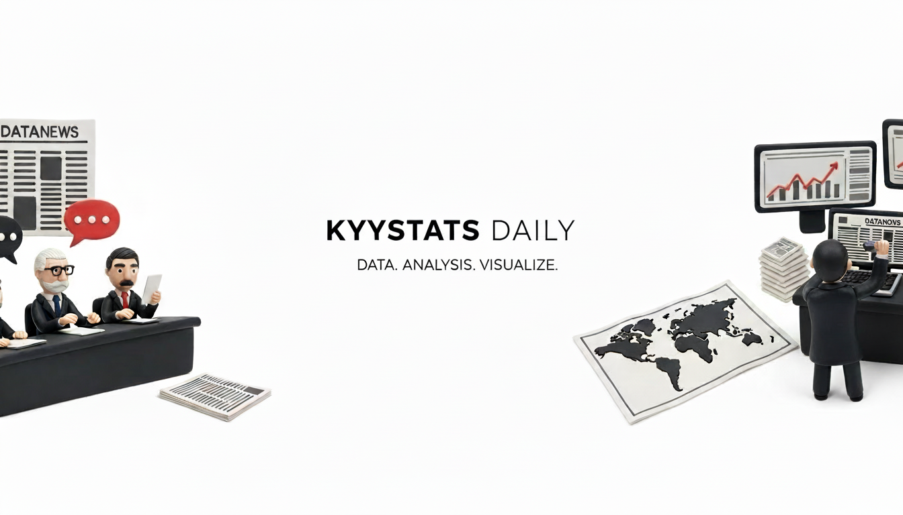

# KyyStats: Data Portfolio

This repository contains my personal data analysis portfolio. It's designed to showcase case studies, impact metrics, and analytical projects where I transform raw datasets into actionable business growth.



## About the Project

I built this site to provide a more interactive way to explore my work beyond static reports. The focus is on descriptive analytics and predictive modeling, specifically targeting logistics optimization and operational scaling.

### Core Features

- **Project Gallery:** A curated list of analytical work.
- **Case Studies:** Detailed walkthroughs of methodology and business outcomes.
- **Impact Metrics:** Visual snapshot of key metrics from past projects.
- **User Experience:** Dark mode support and fully responsive layouts.

## Tech Stack

The frontend is built with a modern, performance-first stack:

- **Framework:** React 19 + TypeScript + Vite
- **Styling:** Tailwind CSS
- **Animations:** Framer Motion
- **Icons:** Lucide React

## Local Development

To get the project running on your local machine:

1. **Clone & Install**

   ```bash
   git clone https://github.com/FebriKaze/kyy-stats.git
   cd kyystats
   npm install
   ```

2. **Configuration**
   Create a `.env.local` file in the root directory for any necessary API keys:

   ```env
   GEMINI_API_KEY=your_key_here
   ```

3. **Run**
   ```bash
   npm run dev
   ```
   Open [http://localhost:3000](http://localhost:3000) to view it in the browser.

## Contact

I'm always open to discussing data problems or potential collaborations.

- **LinkedIn:** [FebriKaze](https://www.linkedin.com/in/febrikaze/)
- **Email:** kyyaspi13@gmail.com
- **Website:** [kyystats.com](https://kyystats.com)

---

_KyyStats - Data Analysis Portfolio_
